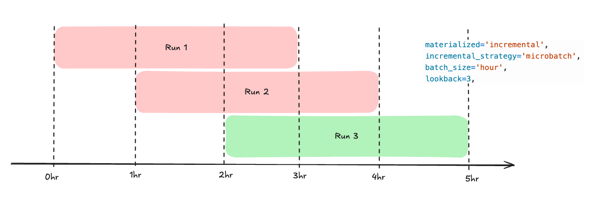
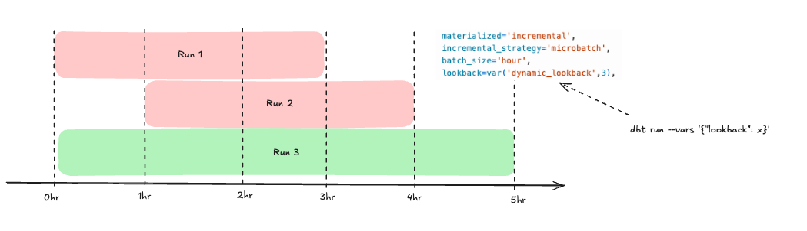
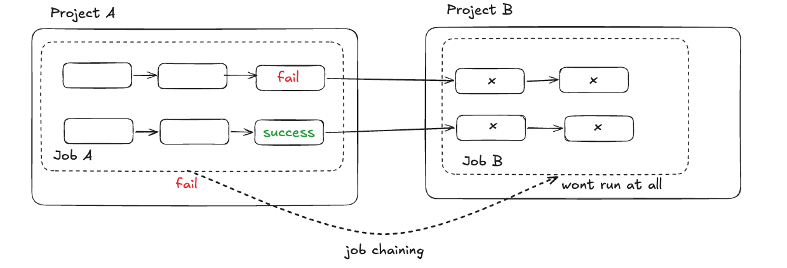
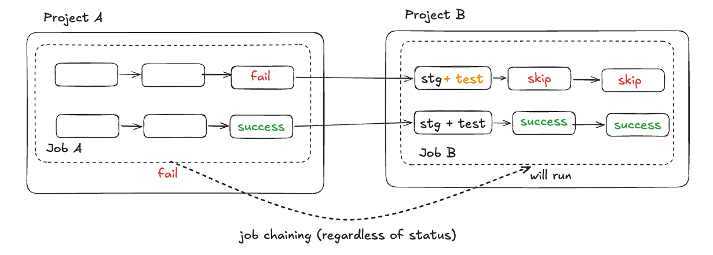

## Use-case 1: Altering behaviour of incremental microbatch 
### Problem: 
1. When using microbatch, the timeframe of each job is constantly moving and just because a future job is executed successfully (run 3 in diagram) does not mean data from previous time frame has been completed (0hr - 2hr didnt process properly due to failure in run 1 and run 2). Hence, this causes retry mechanism to be not the best fit for incremental microbatch

2. This causes a lot of additional effort as customer has to find and write custom backfill job in these scenario to reprocess it instead of just rerunning it.

### Solution: 
To alter the behavior of incremental microbatch to be more simliar to normal incremental where a retry will symbolise that every previous missed runs have been correctly updated as well.
To do so there is a need to have a dynamic lookback. Logic of dynamic lookback can be found in /macros/get_dynamiclookback.sql. 
However, the macro implementation will not work as there is a constraint on dbt where setting config does not allow for introspective queries. 
Hence to enable a true dynamic lookback, there is a need to make use of an external orchestrator with lookback set as a variable. 
 

## Use-case 2: Recommendations in setting cutoff especially for new model introduction 
### Problem: 
When new models are introduced, the initial load is very heavy due to all the pre-existing data. How do we efficiently set cut-off date to allow the model to be fresh while backfill can happen at a separate timeline. 

### Solution: 
This can be achieved by manipulation of `begin` field with a macro found in /macro/get_begin_date.sql. This can ensure the following: 
1. First load without any additional parameter will simply bring in data from the last fixed lookback period.
2. Even if backfill is in progress, manipulation of begin data will not wipe any of the backfill information. 

## Use-case 3: Using SAO to do cross-project model dependency 
### Problem: 
When using job chaining across project, we are more reliant on job dependency rather than model dependency. Hence,this might cause model to be delayed due to an overall job failure.  
 

### Solution: 
1. Simply bring everything back into a single dbt project will resolve this issue.
2. Breakdown the job to different segments however this might cause an increase in the number of job
3. However, if there is a need to maintain multiple dbt project, we can make use of SAO + staging test to resolve it. 
 
The failure in project A could be caused by 2 scenario: 
- data not updated due to upstream failure or sql failed to run -> SAO will automatically detect that there is no data change and skip the model 
- data updated but failed data test -> there is a need for stg model to do data test to make sure that wrong data doesnt get populated 
4. Alternatively, there is a possibility of using webhook + Admin API + a separate function to run. 
